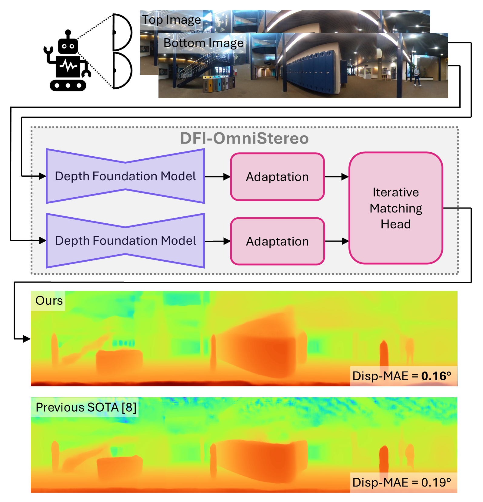
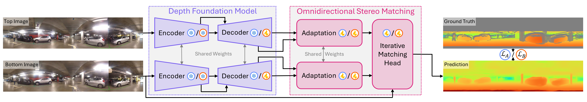

# [IROS 2025] DFI-OmniStereo

[](https://paperswithcode.com/sota/omnnidirectional-stereo-depth-estimation-on?p=boosting-omnidirectional-stereo-matching-with)

[**Project Page**](https://vita-epfl.github.io/DFI-OmniStereo-website/) |
[**Paper**](https://arxiv.org/pdf/2503.23502) |
[**ArXiv**](https://arxiv.org/abs/2503.23502) |
[**Video**](https://www.youtube.com/watch?v=CHDQBl_PPDo)

This is the official repository of our paper accepted at IROS 2025:

**Boosting Omnidirectional Stereo Matching with a Pre-trained Depth Foundation Model**

Authors: [Jannik Endres](https://linkedin.com/in/jannik-endres), [Oliver Hahn](https://olvrhhn.github.io/), [Charles Corbière](https://chcorbi.github.io/), [Simone Schaub-Meyer](https://schaubsi.github.io/), [Stefan Roth](https://www.visinf.tu-darmstadt.de/visual_inference/people_vi/stefan_roth.en.jsp), [Alexandre Alahi](https://people.epfl.ch/alexandre.alahi)

## 🧭 Table of Contents
1. [Abstract](#abstract)
2. [News](#news)
3. [Method](#method)
4. [Usage](#usage)
   - [Installation](#installation)
   - [Training](#training)
   - [Evaluation](#evaluation)
   - [Inference](#inference)
5. [Repository Structure](#repository-structure)
6. [Acknowledgement](#acknowledgement)
7. [Citation](#citation)

<h2 id="abstract">📝 Abstract</h2>

<table width="950">
  <tr>
    <td width="420">
      
    </td>
    <td width="480">

**TL;DR:** Given a pair of equirectangular images captured by two vertically stacked omnidirectional cameras, DFI-OmniStereo integrates a large-scale pre-trained monocular relative depth foundation model into an iterative stereo matching approach. This method improves depth estimation accuracy, significantly outperforming the previous state-of-the-art method on the Helvipad dataset.

**Abstract:** Omnidirectional depth perception is essential for mobile robotics applications that require scene understanding across a full 360° field of view. Camera-based setups offer a cost-effective option by using stereo depth estimation to generate dense, high-resolution depth maps without relying on expensive active sensing. However, existing omnidirectional stereo matching approaches achieve only limited depth accuracy across diverse environments, depth ranges, and lighting conditions, due to the scarcity of real-world data. We present DFI-OmniStereo, a novel omnidirectional stereo matching method that leverages a large-scale pre-trained foundation model for relative monocular depth estimation within an iterative optimization-based stereo matching architecture. We introduce a dedicated two-stage training strategy to utilize the relative monocular depth features for our omnidirectional stereo matching before scale-invariant fine-tuning. DFI-OmniStereo achieves state-of-the-art results on the real-world Helvipad dataset, reducing disparity MAE by approximately 16% compared to the previous best omnidirectional stereo method.
    </td>
  </tr>
</table>

<h2 id="news">📰 News</h2>

- **09/08/2025:** Our paper has been accepted at [IROS 2025](https://www.iros25.org/)! 🎉 Check out the updated [paper](https://arxiv.org/pdf/2503.23502) on [arXiv](https://arxiv.org/abs/2503.23502) and watch the [video](https://www.youtube.com/watch?v=CHDQBl_PPDo).
- **11/04/2025:** Our code is now publicly available in this repository.
- **30/03/2025:** Our paper is available on arXiv.

<h2 id="method">⚙️ Method</h2>



A shared depth foundation model (purple) is utilized to extract representations from a top and bottom image. Subsequently, an omnidirectional stereo matching head (pink) predicts disparity, utilizing the image features as follows: The intermediate representations and relative depth maps of both images are adapted to be processed as multi-scale feature maps by the iterative matching head. This head predicts a disparity map using vertical warping for cost volume construction.

The training consists of two stages. In training stage A (blue), we adapt the stereo matching head to the omnidirectional data and the foundation model features (foundation model frozen) using a conventional stereo matching loss L_A. In stage B (orange), we fine-tune the foundation model decoder and the stereo matching head, utilizing a scale-invariant logarithmic loss L_B. Frozen and trainable modules are denoted with a snowflake and fire symbol, respectively.

<h2 id="usage">🚀 Usage</h2>

We use [Hydra](https://hydra.cc/) for configuration management and [Weights & Biases](https://wandb.ai/site/) for comprehensive experiment tracking and visualization.

<h3 id="installation">🔧 Installation</h3>

#### 1. Set up the environment

```bash
conda create -n dfi-omnistereo python=3.11
conda activate dfi-omnistereo
git clone git@github.com:vita-epfl/DFI-OmniStereo.git
cd DFI-OmniStereo
pip install -r requirements.txt
```

#### 2. Download the Helvipad dataset

Download the [Helvipad dataset](https://huggingface.co/datasets/chcorbi/helvipad) and store it at a location of your choice, e.g: `./data/helvipad`.

#### 3. Download the pretrained weights

##### A. For training
IGEV-Stereo (SceneFlow weights): Create the directory and download the pretrained SceneFlow weights from the [IGEV-Stereo Google Drive](https://drive.google.com/drive/folders/1yqQ55j8ZRodF1MZAI6DAXjjre3--OYOX), as provided by [IGEV-Stereo](https://github.com/gangweix/IGEV):
```bash
mkdir -p ./src/models/dfi_omnistereo/pretrained_models/igev_stereo
```
Place the downloaded file into the directory created above.

Depth Anything V2 Base: Download the Depth-Anything-V2-Base model provided by [Depth Anything V2](https://github.com/DepthAnything/Depth-Anything-V2):
```bash
mkdir -p ./src/models/dfi_omnistereo/pretrained_models/depth_anything && \
wget -O ./src/models/dfi_omnistereo/pretrained_models/depth_anything/depth_anything_v2_vitb.pth \
"https://huggingface.co/depth-anything/Depth-Anything-V2-Base/resolve/main/depth_anything_v2_vitb.pth?download=true"
```

##### B. For evaluation and inference

DFI-OmniStereo main checkpoint: Download our pretrained model checkpoint:
```bash
mkdir -p ./src/models/dfi_omnistereo/pretrained_models/dfi_omnistereo && \
wget -O ./src/models/dfi_omnistereo/pretrained_models/dfi_omnistereo/dfi_omnistereo_helvipad.pth "https://tudatalib.ulb.tu-darmstadt.de/bitstream/handle/tudatalib/4557/dfi_omnistereo_helvipad.pth"
```

<h3 id="training">🏋️‍♂️ Training</h3>

##### Stage A

To train the model from the pretrained depth foundation model and omnidirectional weights (Stage A), run the following command:
```bash
cd src
python train.py \
  --debug=false \
  --exp_name=Stage-A \
  --dataset_root=./data/helvipad/
```
All other parameters are set to their default values for Stage A training.

##### Stage B

To continue training with Stage B, restore the best checkpoint from Stage A. For example, if your Stage A checkpoint is saved at `models/dfi_omnistereo/pretrained_models/best-ckpt-stage-a.pth`, run:
```bash
python train.py \
  --debug=false \
  --exp_name=Stage-B \
  --dataset_root=./data/helvipad/ \
  --restore_ckpt=./models/dfi_omnistereo/pretrained_models/best-ckpt-stage-a.pth \
  --lr=0.00002 \
  --epochs=12 \
  --train_batch_size=1 \
  --train_depth_anything=true \
  --use_silog_loss=true
```

<h3 id="evaluation">📊 Evaluation</h3>

To evaluate our model using the main checkpoint and compute all metrics including Left-Right Consistency Error (LRCE), use:
```bash
cd src
python evaluate.py \
  --debug=false \
  --exp_name=Evaluation \
  --dataset_root=./data/helvipad/ \
  --restore_ckpt=./models/dfi_omnistereo/pretrained_models/dfi_omnistereo/dfi_omnistereo_helvipad.pth \
  --calc_lrce=true
```
Note: Setting `--calc_lrce=true` enables LRCE evaluation, which increases computation time.

<h3 id="inference">🔍 Inference</h3>

#### Helvipad examples

To generate inference results on selected samples from the Helvipad dataset, run the following command:
```bash
cd src
python infer.py \
  --infer_name=helvipad_paper_results \
  --dataset_root=./data/helvipad/ \
  --restore_ckpt=./models/dfi_omnistereo/pretrained_models/dfi_omnistereo/dfi_omnistereo_helvipad.pth \
  --images test-20240120_REC_06_IN-0042 test-20240124_REC_03_OUT-0676 test-20240124_REC_08_NOUT-0717
```
This command will process the following frames (all of which are part of the `test` set):
- `0042` from the scene `20240120_REC_06_IN`
- `0676` from the scene `20240124_REC_03_OUT`
- `0717` from the scene `20240124_REC_08_NOUT`

The results as well as the top and bottom images will be saved to: `src/models/dfi_omnistereo/inference_results/helvipad_paper_results`.

#### 360SD-Net real-world examples

To evaluate our model on real-world examples from the [360SD-Net](https://github.com/albert100121/360SD-Net) dataset:
1. Download the real-world top and bottom images from the [official repo](https://github.com/albert100121/360SD-Net/tree/master/data/realworld).
2. Place the data in a directory of your choice, e.g., `./data/360sd`.
3. Run the following command to perform inference:
```bash
cd src
python infer.py \
  --infer_name=360SD_paper_results \
  --dataset_root=./data/360sd/ \
  --restore_ckpt=./models/dfi_omnistereo/pretrained_models/dfi_omnistereo/dfi_omnistereo_helvipad.pth \
  --dataset=360SD \
  --min_disp_deg=0.0048 \
  --max_disp_deg=178 \
  --max_disp=512 \
  --images hall room stairs
```
This will run inference on the following scenes:
- `hall`
- `room`
- `stairs`

The results will be saved in: `src/models/dfi_omnistereo/inference_results/360SD_paper_results`.

<h2 id="repository-structure">📁 Repository Structure</h2>

Below is an overview of the repository structure, with descriptions for key files and directories:

```
├── docs/                                        # Documentation assets (e.g., images).
│   ├── architecture.png                         # Diagram of the method's architecture.
│   └── overview.png                             # Overview image of the project.
├── src/                                         # Source code for the project.
│   ├── conf/                                    # Configuration files.
│   │   ├── model/                               # Model implementations.
│   │   │   └── dfi_omnistereo.yaml              # Model-specific configuration.
│   │   └── config.yaml                          # General configuration file.
│   ├── general/                                 # General utilities and helper scripts.
│   │   ├── augmentor.py                         # Data augmentation utilities.
│   │   ├── conversion.py                        # Data conversion utilities.
│   │   ├── metrics.py                           # Evaluation metrics.
│   │   ├── stereo_datasets.py                   # Dataset handling for stereo data.
│   │   └── utils.py                             # Miscellaneous utility functions.
│   ├── models/                                  # Model implementations.
│   │   ├── dfi_omnistereo/                      # DFI-OmniStereo-specific models.
│   │   │   ├── depth_foundation_model/          # Depth foundation model part.
│   │   │   │   ├── dpt_dinov2/                  # DPT (see Depth Anything).
│   │   │   │   ├── torchhub/                    # ViT (see DINOv2).
│   │   │   │   └── depth_anything.py            # Depth Anything model.
│   │   │   ├── omnidirectional_stereo_matching/ # Omnidirectional stereo matching part.
│   │   │   │   ├── depth_anything_extractor.py  # Depth feature extraction.
│   │   │   │   ├── extractor.py                 # General feature extraction logic.
│   │   │   │   ├── geometry.py                  # Geometry-related computations.
│   │   │   │   ├── igev_stereo.py               # IGEV-Stereo iterative matching head.
│   │   │   │   ├── submodule.py                 # Submodule utilities.
│   │   │   │   └── update.py                    # Iterative update logic.
│   │   |   └── dfi_model.py                     # Main DFI-OmniStereo model definition.
│   │   └── base_model.py                        # Base model class.
│   ├── evaluate.py                              # Script for model evaluation.
│   ├── infer.py                                 # Script for inference.
│   └── train.py                                 # Script for training the model.
├── .gitignore                                   # Specifies files to ignore in Git.
├── LICENSE                                      # License information for the repository.
├── README.md                                    # Project README file (this file).
└── requirements.txt                             # Python dependencies for the project.
```

<h2 id="acknowledgement">🙏 Acknowledgement</h2>

We thank the authors of [Depth Anything](https://github.com/LiheYoung/Depth-Anything), [DINOv2](https://github.com/facebookresearch/dinov2), [IGEV-Stereo](https://github.com/gangweiX/IGEV), and [RAFT-Stereo](https://github.com/princeton-vl/RAFT-Stereo) for releasing their code.

<h2 id="citation">📚 Citation</h2>

```bibtex
@inproceedings{endres2025dfiomnistereo,
  author        = {Endres, Jannik and Hahn, Oliver and Corbière, Charles and Schaub-Meyer, Simone and Roth, Stefan and Alahi, Alexandre},
  title         = {Boosting Omnidirectional Stereo Matching with a Pre-trained Depth Foundation Model},
  booktitle     = {2025 IEEE/RSJ International Conference on Intelligent Robots and Systems (IROS)},
  year          = {2025},
  organization  = {IEEE}
}
```
